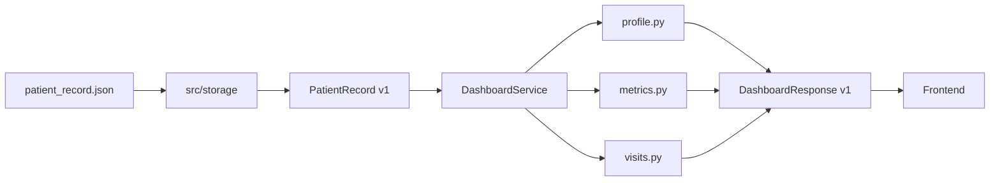

# Backend service и `DashboardResponse v1`

## Назначение

Backend service строит готовое представление дашборда из канонического
`PatientRecord`. Frontend зависит только от `DashboardResponse v1` и не знает:

- исходные имена и вложенность полей МИС;
- правила выбора актуального веса и терапии;
- как лабораторные компоненты превращаются в временные ряды;
- правила сортировки и фильтрации приёмов.

## Контракт ответа

```text
DashboardResponse v1
├── schema_version
├── generated_at
├── patient
├── allergies[]
├── conditions[]
├── current_medications[]
├── metrics[]
│   └── points[]
├── visits[]
├── red_flags[]
└── ai_summary
```

`metrics[]` — универсальная коллекция временных рядов. Экран выбирает ряд по
стабильному backend-коду (`glucose`, `hba1c`, `systolic`), а не ищет данные в
конкретном блоке JSON.

Модели находятся в `src/contracts/dashboard/v1/`. Как и канонический
контракт, они запрещают неизвестные поля и требуют новую major-версию при
несовместимом изменении.

Поля `red_flags` и `ai_summary` уже входят в стабильную форму ответа.
`DashboardService` пока оставляет их пустыми: правила красных флагов будут
подключены отдельным модулем, а проверенный результат `SummaryService`
приложение добавляет в `ai_summary` без изменения контракта v1.

## Проекция профиля

`src/backend/profile.py` формирует шапку пациента. Возраст рассчитывается на
переданную сервису дату, вес/рост/ИМТ берутся из последних наблюдений с
резервом на демографические данные. Если готового ИМТ нет, backend вычисляет
его из актуальных роста и веса.

Текущей терапией считается список назначений из последнего по дате приёма,
где присутствуют связанные `medication_ids`.

## Лента приёмов

`src/backend/visits.py` возвращает приёмы от новых к старым и сохраняет только
стабильные поля ответа: врача, специальность, тип, диагнозы и жалобы.
Исходные поля `VRACH`, `diagnoz_priema` и `JALOBY_TXT` этому слою неизвестны.

## Временные ряды

`src/backend/metrics.py` преобразует scalar observations и компоненты АД в
универсальные `MetricSeries`. Backend публикует ограниченный словарь стабильных
кодов, среди которых:

- `systolic`, `diastolic`, `heart-rate`, `body-weight`, `bmi`;
- `glucose`, `hba1c`, `creatinine`, `potassium`;
- `total-cholesterol`, `ldl-cholesterol`, `hdl-cholesterol`, `triglycerides`.

Русские и международные обозначения единиц нормализуются. Значение с
несовместимой единицей не подмешивается в ряд без доказанной формулы конверсии.
Глюкоза и креатинин мочи не классифицируются как показатели крови. Точки
остаются отдельными и сортируются по времени; канонический слой не изменяется.

## Фасад сервиса

`DashboardService` — единственная точка композиции frontend-ответа:

```python
from src.backend import DashboardService

response = DashboardService().build_from_path(
    "data/output_test/patient_record.json"
)
payload = response.model_dump(mode="json")
```



`src/storage/patient_records.py` отвечает только за чтение, строгую валидацию
и атомарную запись канонического JSON. Проекции получают Pydantic-модель и не
зависят от файловой системы.
`generated_at` и дата расчёта возраста могут передаваться явно, что делает
сервис детерминированным в тестах.
