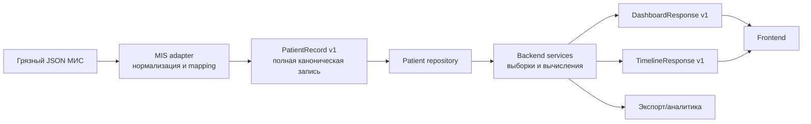

# Backend-driven контракт данных

## Статус решения

Принято для поэтапной реализации в ветке `feat/parser-backend`.

## Проблема текущего подхода

Текущий parser сразу формирует три представления конкретного дашборда:

- `profile.json`;
- `vitals.csv`;
- `visits.csv`.

Эти файлы удобны для первого прототипа, но являются проекциями, а не полной нормализованной медицинской записью. При таком подходе:

- несколько измерений за день агрегируются и теряют точное время;
- лабораторные панели теряют единицы, референсные интервалы, флаги и служебный статус результата;
- приём теряет полный анамнез, объективный статус, назначения и сопутствующие диагнозы;
- операции, госпитализации, вакцинации и инструментальные исследования не входят в контракт;
- правило агрегации оказывается частью parser, хотя это задача конкретного backend-представления;
- новый экран требует изменения низкоуровневого parser-контракта.

На эталонном пациенте вне полного контракта остаются 1 416 лабораторных панелей, 36 инструментальных исследований, 5 346 измерений АД, 2 816 измерений глюкозы, а также операции, госпитализации и вакцинации.

## Цель

Frontend не должен знать:

- исходные имена `PATIENT_INFO`, `PRIEMY_VRACHA`, `JALOBY_TXT` и другие особенности МИС;
- форматы дат и чисел входного генератора;
- где именно хранятся лаборатория, измерения или назначения;
- правила дедупликации и выбора источника.

Frontend зависит только от версионированного backend API или подготовленной backend-проекции.

## Целевая архитектура



### 1. Слой адаптера МИС

Знает грязные входные ключи и преобразует их в канонические модели. Только этот слой меняется при изменении генератора или формата конкретной МИС.

### 2. Канонический контракт

Хранит максимум нормализованных клинических данных без dashboard-агрегации. Основной артефакт первого этапа — `patient_record.json` со `schema_version`.

### 3. Backend services

Строят целевые представления:

- карточку пациента;
- серии для графиков;
- ленту событий;
- красные флаги;
- данные для LLM-сводки.

Именно здесь задаются агрегация по дням, приоритет источников, фильтры и вычисляемые показатели.

### 4. Frontend

Получает стабильный `DashboardResponse`, а не читает parser-файлы и не обращается к исходным полям МИС.

## Каноническая модель `PatientRecord v1`

```text
PatientRecord
├── schema_version
├── patient
├── allergies[]
├── conditions[]
├── medications[]
├── encounters[]
├── observations[]
├── procedures[]
├── hospitalizations[]
├── immunizations[]
└── diagnostic_reports[]
```

### Общие требования к событиям

Каждая клиническая запись по возможности содержит:

- стабильный внутренний `id`;
- `source_id` из исходной МИС;
- точное время события или дату;
- нормализованный `code` и человекочитаемый `display`;
- структурированные значения;
- `source`/provenance, показывающий происхождение данных;
- текстовые поля, если они несут клинический смысл.

### Наблюдения

АД, пульс, вес, глюкоза и лабораторные показатели хранятся отдельными событиями без дневного схлопывания:

```json
{
  "id": "observation-123",
  "patient_id": "0004512-К",
  "encounter_id": "VST-170602-578",
  "observed_at": "2017-06-02T18:45:00",
  "category": "vital-signs",
  "code": "blood-pressure",
  "display": "Артериальное давление",
  "components": [
    {"code": "systolic", "value": 144, "unit": "mmHg"},
    {"code": "diastolic", "value": 75, "unit": "mmHg"}
  ],
  "source": "encounter.measurements"
}
```

Лабораторный результат дополнительно сохраняет референсный диапазон, abnormal-флаг, метод и статус результата.

## Версионирование

- Корневой объект содержит `schema_version`, начиная с `"1.0"`.
- Добавление необязательного поля совместимо внутри одной major-версии.
- Удаление, переименование или изменение смысла поля требует новой major-версии.
- Pydantic-модели и contract-тесты являются исполняемой спецификацией.

### Структура реализации v1

```text
src/contracts/v1/
├── common.py        # базовая модель, provenance, coding, quantity
├── patient.py       # patient, allergies, conditions, medications
├── encounters.py    # encounters, practitioner, diagnoses
├── observations.py  # vitals, laboratory and self-monitoring events
├── history.py       # procedures, hospitalizations, immunizations, reports
└── record.py        # корневой PatientRecord
```

Модели запрещают неизвестные поля (`extra="forbid"`), поэтому исходные имена МИС не могут случайно протечь в публичный backend-контракт.

Для событий с неполной датой контракт не создаёт ложную точность. Например,
`2017` не преобразуется в `2017-01-01`: нормализованное поле остаётся пустым,
а исходная запись сохраняется в `*_at_text`.

### Реализованные MIS-адаптеры

Пакет `src/parser/canonical/` разделён по доменам:

```text
canonical/
├── common.py   # provenance и детерминированные ID
├── dates.py    # date/datetime без потери времени
├── patient.py  # пациент, аллергии, хронические состояния
├── encounters.py # приёмы, диагнозы и назначения
└── history.py  # операции, госпитализации, прививки, исследования
```

Адаптеры не экспортируют исходные имена полей в контракт. Их происхождение
фиксируется через `SourceReference(block, source_id, path)`. Служебные записи,
явно помеченные как удалённые или дубли, не включаются.

`encounters.py` сохраняет жалобы, анамнез, объективный статус, план, тип
приёма, кабинет, врача, основной и сопутствующие диагнозы. Назначения
становятся отдельными `Medication`, а encounter содержит их стабильные ID.

## Совместимая миграция

Старые `profile.json`, `vitals.csv` и `visits.csv` временно сохраняются как legacy dashboard projection.

Порядок миграции:

1. Добавить Pydantic-модели `PatientRecord v1` и contract-тесты.
2. Реализовать небольшие адаптеры по доменам: patient, encounters, observations и clinical history.
3. Начать сохранять `patient_record.json` вместе с текущими файлами.
4. Добавить backend service, который строит `DashboardResponse v1` из `PatientRecord`.
5. Перевести frontend на backend service.
6. После миграции пометить три старых файла deprecated и удалить отдельной major-версией.

## Правило сохранности данных

Канонический слой не выполняет необратимые преобразования без необходимости:

- не агрегирует несколько событий в одно;
- не удаляет клинический текст, единицы и референсы;
- не смешивает значения из разных источников;
- не подменяет исходную точность округлением для графика;
- явно исключает только служебные/legacy-блоки с документированной причиной.

Проекции backend могут агрегировать и фильтровать данные, потому что всегда могут быть повторно построены из `PatientRecord`.
