# Контракты данных и границы модулей

Эта страница описывает фактически реализованные контракты MIS Dash. Исполняемой
спецификацией служат Pydantic-модели в `src/contracts/` и contract-тесты.
Исходные имена полей МИС разрешено знать только parser.

## Зачем нужен канонический слой

Первый прототип parser формировал отдельные файлы для профиля, графиков и
визитов. Такие файлы были проекциями конкретного интерфейса и теряли исходную
детализацию: точное время измерений, состав лабораторной панели, единицы,
референсы, полный текст приёма и события, не показанные на первом экране.

Текущая граница разделяет две задачи:

- `PatientRecord 1.0` хранит нормализованную медицинскую историю без
  dashboard-агрегации;
- `DashboardResponse 1.1` содержит стабильную проекцию, готовую для
  интерфейса.

Благодаря этому новая выгрузка МИС требует изменения адаптера, а новый экран —
backend-проекции, но не обоих слоёв одновременно.

## Фактический поток данных



Все имена на схеме соответствуют существующим каталогам или Pydantic-моделям.
MIS Dash, кроме внешнего Gemini API, работает как одно Python-приложение
Streamlit; прямоугольники не обозначают отдельные сетевые сервисы.

Основной поток интерфейса выполняется в памяти:

1. `src/app/source.py` получает байты загруженного JSON или вызывает
   `src/generator` для синтетической выгрузки.
2. `src/app/data.py` временно сохраняет выбранные JSON-байты.
3. `MISParser.parse_record()` возвращает `PatientRecord`.
4. `DashboardService.build(record)` возвращает `DashboardResponse`.
5. Компоненты Streamlit читают только поля `DashboardResponse`.

`patient_record.json` — опциональный артефакт, а не обязательная промежуточная
база. Его создаёт `MISParser.parse()`, а
`DashboardService.build_from_path()` может загрузить его через `src/storage`.
Обычная загрузка файла в Streamlit эти методы не использует, поэтому
`OUTPUT_DIR` не меняет поведение интерфейса.

ИИ-сводка запускается отдельной кнопкой. Оркестратор приложения передаёт
`SummaryService` канонические тексты из `PatientRecord` и уже видимые факты из
`DashboardResponse`. Компоненты интерфейса при этом по-прежнему не читают
исходный JSON.

## Ответственность слоёв

| Слой | Вход | Выход | Что ему разрешено знать |
| --- | --- | --- | --- |
| `src/generator` | `GenerationConfig` | синтетический грязный JSON | шаблоны тестовой персоны и намеренные искажения |
| `src/parser` | грязный JSON МИС | `PatientRecord 1.0` | aliases, пропуски, форматы дат и структура конкретной выгрузки |
| `src/quality` | сгенерированный JSON и `PatientRecord` | именованный QA-отчёт | ожидаемая семантика generator и публичный контракт parser; только developer flow |
| `src/storage` | `PatientRecord` или JSON канонической записи | валидированный `PatientRecord` | только канонический контракт и файловая система |
| `src/backend` | `PatientRecord` | `DashboardResponse 1.1` | правила актуальности, frontend-проекции и связь входов калькуляторов |
| `src/calculators` | нормализованные числа | рассчитанные значения | чистые формулы и их ограничения |
| `src/summarizer` | ограниченные факты из двух контрактов | `ClinicalSummary` | текстовый контекст, prompt и structured output |
| `src/app` | JSON-байты и два валидированных контракта | интерфейс | выбор источника, отображение и состояние сессии |

## Сырой формат generator

Выход `src/generator` намеренно содержит неоднородные и служебные поля. Это
тестовый вход для tolerant reader, а не четвёртый публичный контракт MIS Dash.
Frontend не обращается к этим ключам, а изменения грязных форм локализуются в
parser и его тестах.

Конфигурация `seed=42`, `years=9`, `light=False` побайтово воспроизводит
`data/patient_etalon.json`. Другие параметры меняют объём истории и вариации
представления, но в текущей версии всё ещё описывают одну фиксированную
синтетическую персону. Подробности API и ограничений:
[синтетический generator](generator.md).

## `PatientRecord 1.0`

Корневая модель находится в `src/contracts/patient/v1/record.py`.

```text
PatientRecord
├── schema_version = "1.0"
├── patient
├── social_history?
├── family_history[]
├── allergies[]
├── conditions[]
├── medications[]
├── encounters[]
├── observations[]
├── procedures[]
├── hospitalizations[]
├── immunizations[]
└── diagnostic_reports[]
```

Канонический слой не агрегирует события по дням и не отбрасывает клинический
текст ради текущего интерфейса. В частности:

- `Encounter` сохраняет жалобы, анамнез, объективный статус, план, врача,
  диагнозы и ссылки на назначения;
- `Observation` хранит отдельное измерение или лабораторный результат с
  единицей, референсом, методом, статусом и связями; предупреждения о гемолизе,
  хилёзе и повторном исследовании сохраняются в
  `context.laboratory_comment`;
- `DiagnosticReport` объединяет метаданные исследования и ссылается на
  лабораторные `Observation` через `observation_ids`;
- операции, госпитализации, прививки, социальный и семейный анамнез остаются
  самостоятельными типизированными событиями.

### Идентификаторы и происхождение

Клинические события наследуют два обязательных поля:

- `id` — внутренний идентификатор события;
- `source` — объект `SourceReference(block, source_id, path)`.

Если в МИС есть собственный ID, parser предпочитает его. Иначе используется
позиционный fallback вида `<prefix>-<index>`. Такой ID воспроизводим для
неизменённой выгрузки, но может измениться после перестановки записей без
исходных идентификаторов. `source.path` позволяет найти место события в
загруженном блоке. После объединения дублей приёмов путь указывает на выбранную
основную запись в исходном массиве, а не на её позицию в сокращённой
коллекции.

### Пример наблюдения

Ниже приведён объект, соответствующий реальной схеме `Observation`; исходные
имена МИС в него не входят.

```json
{
  "id": "VST-170602-578-bp",
  "source": {
    "block": "PRIEMY_VRACHA",
    "source_id": "VST-170602-578",
    "path": "PRIEMY_VRACHA[12]"
  },
  "observed_at": "2017-06-02T18:45:00",
  "category": "vital-signs",
  "coding": {
    "code": "blood-pressure",
    "display": "Артериальное давление"
  },
  "components": [
    {
      "coding": {
        "code": "systolic",
        "display": "Систолическое АД"
      },
      "value": {
        "value": 144,
        "unit": "mmHg"
      }
    },
    {
      "coding": {
        "code": "diastolic",
        "display": "Диастолическое АД"
      },
      "value": {
        "value": 75,
        "unit": "mmHg"
      }
    }
  ],
  "encounter_id": "VST-170602-578"
}
```

Поля, отсутствующие в JSON-примере, получают значения по умолчанию модели.
Pydantic запрещает неизвестные поля (`extra="forbid"`), поэтому
`patient_id`, строковый `source` или плоские `code`/`value` были бы ошибкой
контракта.

### Точность дат

Дата может быть `date` или `datetime`. Parser сохраняет время, когда оно
известно, и не создаёт ложную точность. Например, строка `2017` не становится
`2017-01-01`: нормализованное поле остаётся пустым. Исходное значение
дополнительно сохраняется только в предусмотренных схемой полях
`follow_up_at_text`, `performed_at_text`, `admitted_at_text`,
`discharged_at_text`, `administered_at_text` и `effective_at_text`. У
`Patient.birth_date`, `Condition.onset` и `Encounter.occurred_at` парного
текстового поля нет.

### Реализованные адаптеры

`src/parser/canonical/` разделён по доменам:

```text
canonical/
├── common.py          # provenance и внутренние ID
├── dates.py           # клинические date/datetime и неполные даты
├── patient.py         # пациент, аллергии, хронические состояния
├── social.py          # образ жизни и семейный анамнез
├── encounters.py      # приёмы, диагнозы и назначения
├── observations/      # лаборатория, дневник и измерения приёмов
├── history.py         # операции, госпитализации, прививки, исследования
└── builder.py         # композиция PatientRecord
```

Служебные `legacy_import_v3`, `sluzhebnoe` и `EHR_EVENT_LOG` не копируются в
`PatientRecord`: это журналы и дубли импорта, а не самостоятельные клинические
события. Новое исключение клинического блока требует отдельного решения.

Для текущего `data/patient_etalon.json` parser формирует 81 приём, 20 268
наблюдений и 1 452 диагностических отчёта. Из наблюдений 13 508 относятся к
самоконтролю, 6 293 — к лаборатории, 467 — к измерениям на приёмах. Эти числа
служат регрессионным ориентиром для эталонной синтетической выгрузки, а не
ограничением контракта.

## `DashboardResponse 1.1`

Корневая модель находится в `src/contracts/dashboard/v1/response.py`.

```text
DashboardResponse
├── schema_version = "1.1"
├── generated_at
├── patient
├── allergies[]
├── conditions[]
├── current_medications[]
├── metrics[]
├── visits[]
├── red_flags[]
└── ai_summary?
```

`metrics` — универсальная коллекция временных рядов. Прямые и рассчитанные
точки имеют единый интерфейс, но рассчитанный ряд дополнительно содержит
`calculation`, а точка — `calculation_inputs` и `source_ids`. Формулы не
записываются обратно в `PatientRecord`.

`red_flags` уже зарезервирован контрактом и отображается интерфейсом, но
детерминированный rules engine пока не реализован. `ai_summary` заполняется
приложением только после успешной валидации `ClinicalSummary` и форматирования
его в Markdown. Подробнее: [backend](backend.md), [frontend](frontend.md) и
[summarizer](summarizer.md).

## Версионирование

В проекте используются три разные формы версионирования:

- `PatientRecord` требует точное `schema_version: "1.0"`;
- `DashboardResponse` требует точное `schema_version: "1.1"`;
- `ClinicalSummary` находится в `src/contracts/summarizer/v1`, но отдельного поля
  `schema_version` не имеет; совместно с ним версионируется prompt через
  `PROMPT_VERSION`.

Каталог `v1` обозначает major-линию контракта. Изменение, которое ломает
существующих потребителей, требует нового каталога `v2`. Добавление
необязательной трассировки расчётов изменило только `DashboardResponse` с
`1.0` на `1.1`; форма `PatientRecord` тогда не менялась и осталась `1.0`.

Текущие `Literal` и `extra="forbid"` намеренно строги: модель этого релиза не
принимает произвольную будущую `1.x` автоматически. Для поддержки новой
minor-версии нужно обновить модель и тесты либо добавить явную миграцию.

## Правило сохранности данных

Канонический слой:

- не объединяет несколько клинических событий в одно;
- не смешивает значения разных источников;
- не удаляет единицы, референсы и значимый текст;
- не округляет исходные значения ради графика;
- исключает только документированные служебные блоки.

Backend может фильтровать и вычислять представление, потому что его всегда
можно повторно построить из `PatientRecord`.
