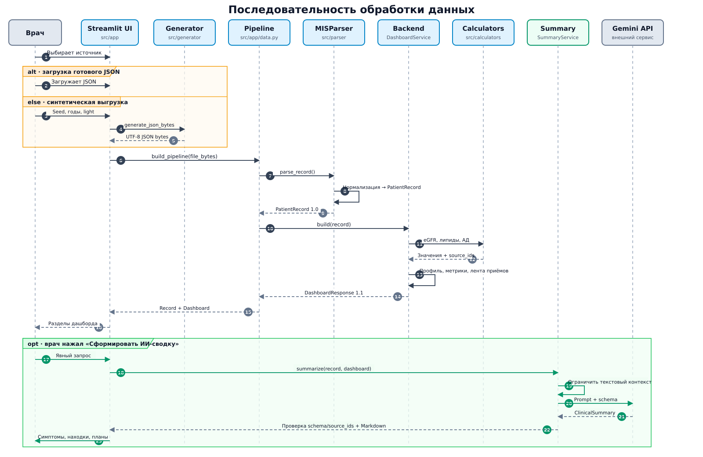

# Frontend MIS Dash

`src/app` — тонкий Streamlit-слой над `DashboardResponse 1.1`. Он отвечает за
выбор источника JSON, композицию экранов и состояние интерфейса, но не разбирает
поля исходной МИС и не вычисляет медицинские показатели.

## Запуск

Из корня репозитория:

```bash
python -m venv .venv
source .venv/bin/activate
pip install -r requirements.txt
cp .env.example .env
streamlit run src/app/main.py
```

`GEMINI_API_KEY` нужен только для ИИ-сводки: без него профиль, графики и приёмы
продолжают работать. `OUTPUT_DIR` относится к файловому методу
`MISParser.parse()` и не меняет Streamlit: выбранная выгрузка обрабатывается
через `parse_record()` в памяти. Реальные ключи и медицинские данные нельзя
добавлять в Git.

## Выбор источника

Переключатель «Источник данных» предлагает два сценария:

- **Загрузить JSON** — передать существующую выгрузку;
- **Сгенерировать синтетическую выгрузку** — указать `seed`, глубину истории
  от 1 до 9 лет и режим сокращённых приёмов и исследований.

Generator вызывается только после кнопки формы, а не при каждом rerun. Значения
по умолчанию — `seed=7`, три года и включённый `light`. Этот режим уменьшает
число приёмов, лабораторных заказов и инструментальных исследований, но не
плотность дневников самоконтроля. Созданный JSON хранится в
`st.session_state`, повторно используется при переключении элементов
интерфейса и доступен для скачивания.

## Поток данных

```text
Загруженный JSON ─────────────┐
                             ├─> JSON bytes
Форма -> src/generator ───────┘
    -> src/app/data.py: build_pipeline()
    -> MISParser
    -> PatientRecord 1.0
    -> DashboardService
    -> DashboardResponse 1.1
    -> компоненты Streamlit
```

`source.py` приводит оба сценария к одному `PatientInput` с JSON-байтами,
именем файла и признаком происхождения. `data.py` сохраняет байты во временный
файл только на время вызова parser и удаляет его в `finally`. Один кешируемый
`build_pipeline()` строит и `PatientRecord`, и `DashboardResponse`, поэтому
parser/backend не запускаются повторно для одного содержимого. Кеш ограничен
четырьмя входами.

Детерминированные компоненты получают Pydantic-модель `DashboardResponse`,
поэтому не зависят от имён ключей в грязном JSON. Только orchestration-код
ИИ-сводки дополнительно получает `PatientRecord`, чтобы выбрать свободный
текст. Синтетический файл не получает привилегированного пути: он проходит тот
же `MISParser`, что и загруженный.

Полная последовательность, включая необязательный вызов Gemini:



## Структура модуля

- `main.py` — точка входа и порядок блоков страницы;
- `source.py` — переключатель загрузки/generator, форма и исходный JSON;
- `data.py` — общая граница между JSON-байтами, parser и backend;
- `summary.py` — явный запуск Gemini и кеширование результата в сессии;
- `components/patient.py` — профиль, аллергии, диагнозы и терапия;
- `components/metrics.py` — вкладки и Plotly-графики;
- `components/visits.py` — таблица врачебных приёмов;
- `components/insights.py` — красные флаги и готовая ИИ-сводка.

## Группы показателей

Frontend группирует стабильные backend-коды только для навигации. Название
вкладки не является диагнозом и не меняет контракт данных.

| Вкладка | Коды временных рядов |
| --- | --- |
| Артериальное давление | `systolic`, `diastolic`, `pulse-pressure` |
| Гликемический контроль | `glucose`, `hba1c` |
| Почки | `creatinine`, `egfr-ckd-epi-2021`, `urine-albumin-creatinine-ratio`, `potassium` |
| Липиды | `total-cholesterol`, `non-hdl-cholesterol`, `ldl-cholesterol`, `calculated-ldl-cholesterol`, `hdl-cholesterol`, `triglycerides` |
| Вес и BMI | `body-weight`, `bmi` |

Показываются только вкладки, для которых есть непустые ряды. Внутри группы
показатели с одинаковой единицей попадают на один график, а с разными единицами
— на отдельные. Рендерится только открытая вкладка: это уменьшает число
одновременно созданных Plotly-графиков и предотвращает сбои плотной страницы.
Для длинных рядов маркеры скрываются, а начальный диапазон ограничивается
последним годом.

Backend также умеет публиковать `heart-rate`, `oxygen-saturation` и
`body-temperature`, но в текущий allowlist `METRIC_GROUPS` они не входят и
отдельных вкладок для них нет. Добавление ряда в backend само по себе поэтому
не создаёт новый график.

Производные показатели визуально помечаются как расчётные. Под графиками
frontend универсально отображает переданный backend-блок `calculation`: что это
за показатель, какие данные использованы, для чего он нужен, метод, основание,
ограничения и ссылки. Если backend передал категорию значения (`G*` или `A*`),
она показывается во всплывающей подсказке точки. Формулы и медицинские пояснения
не зашиты в Streamlit.

В том же раскрывающемся блоке показывается демонстрация последней доступной
расчётной точки: дата, фактические операнды, единицы, ID исходных наблюдений,
результат и категория. Данные приходят в `calculation_inputs` схемы
`DashboardResponse 1.1`; frontend только форматирует их и не повторяет
вычисления.

## ИИ-сводка и состояние сессии

Gemini вызывается только по кнопке. Результат хранится в `st.session_state` по
хешу файла, модели и версии промпта, поэтому обычный rerun или переключение
вкладок не расходуют квоту повторно. Новый файл получает другой ключ и не видит
сводку предыдущего пациента. Ошибка API отображается предупреждением и не
прерывает остальной дашборд. Подробности контракта описаны в
[документации summarizer](summarizer.md).

## Красные флаги

`components/insights.py` не содержит медицинских порогов. Он читает готовые
`dashboard.red_flags` и отображает `critical` через `st.error`, `warning` через
`st.warning`, а `info` через `st.info`. Значения, даты и ограничения формирует
backend rules engine; его правила описаны в
[документации красных флагов](red_flags.md).

## Проверка изменений

```bash
pytest -q tests/test_app_data.py tests/test_app_source.py \
  tests/test_app_metrics.py \
  tests/test_app_insights.py tests/test_app_patient.py \
  tests/test_app_summary.py tests/test_app_visits.py
pytest -q
```

При добавлении временного ряда сначала опубликуйте стабильный код в backend,
затем включите его в подходящую `MetricGroup` и обновите таблицу выше и тесты.
Новый компонент должен принимать `DashboardResponse` или его типизированную
часть, а не словарь исходной выгрузки.

## Заметки по развитию frontend

- аутентификация и production deployment не реализованы;
- `st.cache_data` и session state рассчитаны на синтетический прототип; для
  реальных медицинских данных понадобятся аутентификация, изоляция пользователей
  и отдельная политика хранения;
- перед релизом нужно проверить интерфейс на нескольких конфигурациях
  встроенного generator и на узком экране;
- решения о новых вкладках, состояниях и ограничениях frontend следует
  фиксировать в этом разделе вместе с изменением кода.
