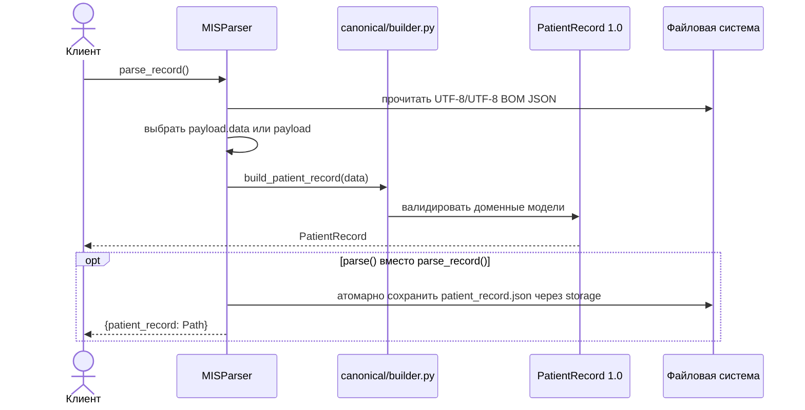

# Модуль `parser`: устройство и поток данных

`src/parser` преобразует грязную JSON-выгрузку МИС в единственный
канонический контракт `PatientRecord 1.0`. Parser не строит представления
конкретного экрана и не выполняет необратимую дневную агрегацию.

## Публичный API

Основной сценарий работает без промежуточного файла:

```python
from src.parser import MISParser

record = MISParser("data/patient_etalon.json").parse_record()
```

Если каноническую запись нужно сохранить:

```python
paths = MISParser("data/patient_etalon.json").parse()
print(paths["patient_record"])
```

`parse()` сохраняет только `patient_record.json`. `run()` является его
командным алиасом. Выходная директория выбирается в порядке:

1. аргумент `output_dir`;
2. переменная окружения `OUTPUT_DIR`;
3. `data/processed/`.

Локальный `.env` загружается при импорте пакета через `python-dotenv`.
`OUTPUT_DIR` применяется только к `parse()`/`run()`: `parse_record()` ничего
не записывает и не создаёт выходную директорию.

## Архитектура



`engine.py` — тонкий фасад. Вся mapping-логика разделена по клиническим
доменам и композируется только в `canonical/builder.py`. Сплошные стрелки на
схеме показывают основной путь построения контракта, пунктирные — внутренние
зависимости builder и адаптеров.

### Ответственность модулей

| Модуль | Ответственность |
|---|---|
| `engine.py` | Загрузка исходного JSON, выбор `data`/корня, запуск canonical builder. |
| `constants.py` | Маркеры пропусков, подсказки для распознавания коллекций, default output path. |
| `normalizers.py` | Даты, числа, текст и физиологическая валидация. |
| `records.py` | Безопасный доступ, альтернативные имена, keyed-коллекции, дубли приёмов. |
| `extractors.py` | Детерминированное извлечение АД и ЧСС из текста. |
| `canonical/common.py` | `SourceReference`, внутренние ID и сохранение исходного текста неточной даты для полей с парным `*_at_text`. |
| `canonical/dates.py` | Клинические `date`/`datetime`, Unix timestamp и контроль точности даты. |
| `canonical/patient.py` | Пациент, аллергии и хронические состояния. |
| `canonical/social.py` | Образ жизни и семейный анамнез. |
| `canonical/encounters.py` | Полные приёмы, диагнозы и назначения. |
| `canonical/observations/` | Отдельные адаптеры дневника, лаборатории, прямых и извлечённых измерений приёмов. |
| `canonical/history.py` | Операции, госпитализации, прививки и инструментальные отчёты. |
| `canonical/builder.py` | Сборка корневого `PatientRecord`. |
| `src/storage/patient_records.py` | Валидация и атомарная запись канонического JSON для `parse()`. |

## Последовательность выполнения



## Отказоустойчивый обход

`records.first()` ищет первое содержательное значение по нескольким aliases и
никогда не использует обязательный доступ `mapping[key]`. `records.records()`
понимает и обычные массивы, и коллекции, индексированные ключами:

```json
{"v1": {"id_priema": "v1"}, "v2": {"id_priema": "v2"}}
```

Отсутствующий или неверно типизированный блок даёт пустую коллекцию/значение,
но не `KeyError` или `AttributeError`. Синтаксически неверный JSON остаётся
явной ошибкой `ValueError`, а инфраструктурные ошибки не маскируются.

## Нормализация

Даты поддерживают ISO, `DD.MM.YYYY`, `DD/MM/YYYY`, `YYYYMMDD`, варианты со
временем и Unix timestamp. Canonical adapter сохраняет `datetime`, если время
известно. Неполный год вроде `2017` не превращается в искусственное
`2017-01-01`. Исходный текст сохраняется в парном поле только там, где оно
предусмотрено контрактом: для повторного приёма, процедуры, госпитализации,
прививки и даты инструментального отчёта. Для даты рождения, начала состояния
и даты самого приёма нераспознанное значение становится `None`: отдельных
`birth_date_text`, `onset_text` и `occurred_at_text` в `PatientRecord 1.0` нет.

Числа принимаются как `int`, `float` или строки с точкой/запятой. Булевы,
бесконечные и составные строки числами не считаются.
`NaN` и бесконечности также считаются пропусками при выборе fallback alias.

```python
from src.parser.normalizers import normalize_date, parse_number

normalize_date("14.03.1967")  # "1967-03-14"
parse_number("46,5")          # 46.5
```

## Дубли приёмов

`records.unique_visits()` считает ID с суффиксами `_dup`/`-dup` одной
логической записью. Более полная запись становится основной, а отсутствующие
части дополняются из дубля. Если одна из копий содержит время приёма, parser
сохраняет более точное значение даты. Адаптеры получают индекс выбранной
исходной записи, поэтому `source.path` после объединения по-прежнему указывает
на существующий элемент грязного JSON. При отсутствии ID используется
составной признак из даты, врача, диагноза и жалоб.

## Наблюдения

Каждое валидное измерение остаётся отдельным `Observation` с точной датой,
единицей, источником и связями. АД хранится компонентами systolic/diastolic;
пульс — отдельным событием. Лабораторные результаты сохраняют референсы,
флаги, метод, статус, биоматериал, клинический комментарий
`context.laboratory_comment` и связь с `DiagnosticReport`.

Regex для свободного текста используется как fallback после структурированных
полей. Систолическое и диастолическое давление никогда не смешиваются из
разных фрагментов.

Лабораторная панель представлена `DiagnosticReport`, а отдельные результаты —
связанными с ним `Observation` через `report_id`/`observation_ids`. Значения не
копируются в `components` отчёта и не схлопываются по дню.

## Выходной контракт

Корень `PatientRecord` содержит `schema_version: "1.0"`, пациента и коллекции
клинических событий. Pydantic-модели запрещают неизвестные поля, поэтому сырые
ключи МИС не могут случайно стать частью backend API. Полная схема описана в
[контракте данных](data_contract.md).

## Как расширять parser

При добавлении нового клинического домена:

1. расширить соответствующие модели в `src/contracts/patient/v1/`;
2. создать отдельный адаптер в `src/parser/canonical/`;
3. подключить его только в `canonical/builder.py`;
4. добавить contract-тесты и тесты грязных форм входа;
5. обновить этот документ, [контракт данных](data_contract.md) и при
   необходимости общую [диаграмму parser](diagrams/README.md).

Новое альтернативное имя поля добавляется рядом с текущими aliases в
соответствующем adapter. Новый формат даты добавляется в normalizer с
параметризованным тестом.

## Проверка

```bash
pytest -q
```

Тесты покрывают контракты, форматы дат/чисел, regex, неправильные типы,
keyed-коллекции, дубли, все canonical adapters и полный parser pipeline.
