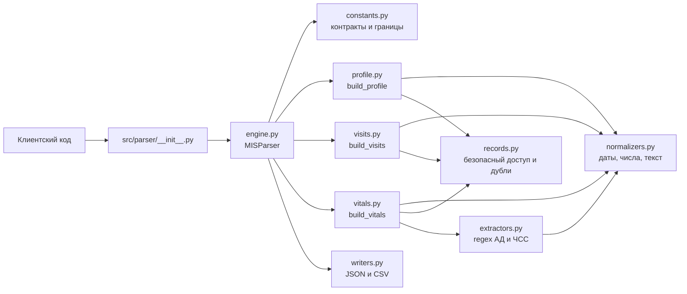
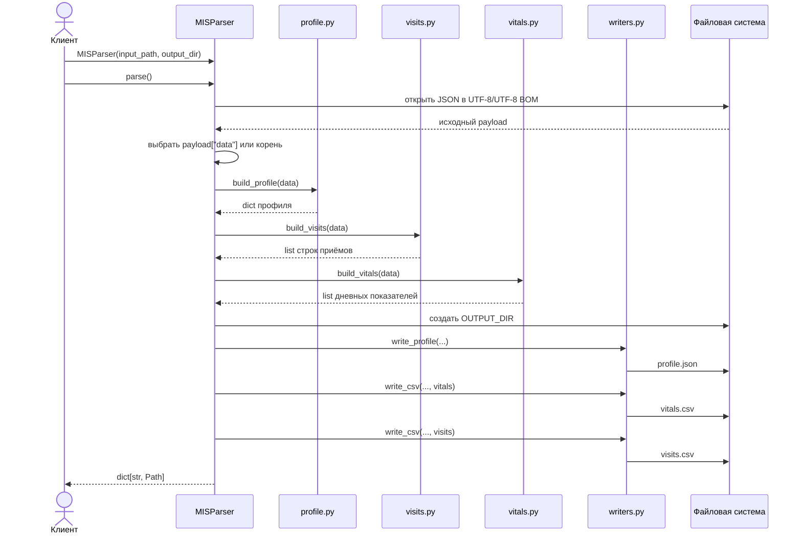
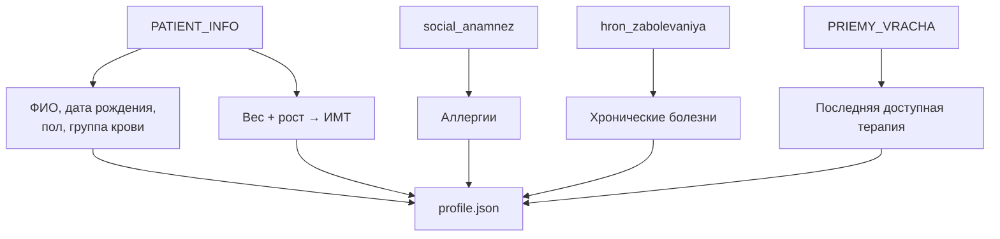
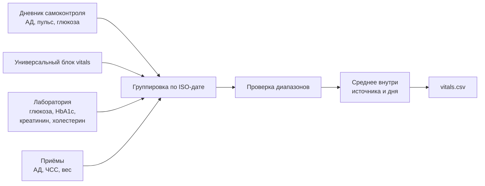

# Модуль `parser`: устройство и поток данных

Модуль `src/parser` преобразует «грязную» JSON-выгрузку МИС в стабильные
backend-контракты. Во время совместимой миграции `MISParser` продолжает
формировать три legacy-проекции для дашборда:

- `profile.json` — карточка пациента;
- `vitals.csv` — дневной временной ряд показателей;
- `visits.csv` — лента врачебных приёмов.

Главная точка входа — класс `MISParser` из `src.parser` или `src.parser.engine`.

```python
from src.parser import MISParser

paths = MISParser("data/patient_etalon.json").parse()

print(paths["profile"])
print(paths["vitals"])
print(paths["visits"])
```

Метод `run()` является полным синонимом `parse()`.

## 1. Общая архитектура

`engine.py` не содержит доменной логики. Это фасад, который загружает JSON, вызывает специализированные сборщики и сохраняет результат.



### Ответственность файлов

| Файл | Ответственность |
|---|---|
| `__init__.py` | Загружает `.env` через `python-dotenv`, экспортирует `MISParser` и `OUTPUT_DIR`. |
| `engine.py` | Публичный фасад: чтение JSON, запуск сборщиков, создание выходной директории и запись файлов. |
| `constants.py` | Имена и порядок полей контрактов, допустимые диапазоны показателей, маркеры пропусков. |
| `normalizers.py` | Нормализация дат, чисел, строк, пола и возраста; проверка чисел и пары АД. |
| `records.py` | Безопасный обход словарей, поддержка альтернативных имён, коллекции записей и объединение дублей. |
| `extractors.py` | Регулярные выражения для извлечения АД и ЧСС из свободного текста. |
| `profile.py` | Сборка `profile.json`: ФИО, возраст, ИМТ, аллергии, диагнозы и текущая терапия. |
| `visits.py` | Сборка строк `visits.csv` и сортировка приёмов по датам. |
| `vitals.py` | Сбор показателей из дневника, лаборатории и приёмов; дневная агрегация и приоритет источников. |
| `writers.py` | Сериализация UTF-8 JSON и CSV с фиксированным порядком колонок. |
| `canonical/common.py` | Общие provenance-ссылки и детерминированные ID канонических событий. |
| `canonical/dates.py` | Нормализация клинических дат с сохранением времени и без ложной точности. |
| `canonical/patient.py` | Адаптация пациента, аллергий и хронических диагнозов в `PatientRecord v1`. |
| `canonical/encounters.py` | Полные приёмы, основной/сопутствующие диагнозы и связанные назначения. |
| `canonical/history.py` | Адаптация операций, госпитализаций, прививок и инструментальных отчётов. |

Канонические адаптеры добавляются по доменам. Пока они не подключены к
`MISParser.parse()`, набор возвращаемых файлов остаётся прежним; интеграция в
`patient_record.json` выполняется отдельным этапом.

## 2. Последовательность выполнения



### Выбор выходной директории

При создании `MISParser` используется первый доступный вариант:

1. Явный аргумент `output_dir`.
2. Переменная окружения `OUTPUT_DIR`.
3. Значение по умолчанию `data/processed/`.

```python
# Перекрывает и .env, и значение по умолчанию.
parser = MISParser(
    "data/patient_etalon.json",
    output_dir="/tmp/mis-result",
)
```

Для локального тестирования можно задать в `.env` значение `OUTPUT_DIR=data/output_test/`, чтобы не перезаписывать контрактные примеры в `data/processed/`.

## 3. Что происходит с входным JSON

### 3.1. Загрузка и выбор медицинского блока

`MISParser._load_json()` читает файл с кодировкой `utf-8-sig`. Это позволяет принимать как обычный UTF-8, так и UTF-8 с BOM.

Если JSON синтаксически повреждён, ошибка `JSONDecodeError` преобразуется в понятный `ValueError` с именем файла. После загрузки `_medical_data()` поддерживает обе формы входа:

```json
{
  "result": {"code": 0},
  "data": {
    "PATIENT_INFO": {}
  }
}
```

и:

```json
{
  "PATIENT_INFO": {}
}
```

### 3.2. Безопасный доступ к полям

Функция `records.first()` ищет значение по нескольким возможным именам и не обращается к ключу через `mapping[key]`. Например, дата рождения ищется по цепочке:

```text
birht_date → birtf_date → birth_date → DATE_ROJD → date_rojd
```

Если поле или блок отсутствует, возвращается `None`, пустая строка или пустой список в зависимости от выходного контракта. Поэтому отсутствие `social_anamnez`, `instrumental_issled` или `PRIEMY_VRACHA` не вызывает `KeyError`/`AttributeError`.

`records.records()` также поддерживает две формы коллекций:

```json
[
  {"id_priema": "v1"},
  {"id_priema": "v2"}
]
```

и:

```json
{
  "v1": {"id_priema": "v1"},
  "v2": {"id_priema": "v2"}
}
```

## 4. Нормализация

### Даты

`normalizers.normalize_date()` возвращает ISO-дату `YYYY-MM-DD` или `None`.

Поддерживаются:

- `YYYY-MM-DD`;
- `DD.MM.YYYY`;
- `DD/MM/YYYY`;
- варианты с двузначным годом;
- ISO datetime;
- `YYYYMMDD`;
- дата со временем `DD.MM.YYYY HH:MM`;
- Unix timestamp числом или строкой;
- Unix timestamp в миллисекундах/микросекундах.

Unix timestamp интерпретируется в UTC, поэтому дата не зависит от часового пояса сервера.

```python
from src.parser.engine import normalize_date

normalize_date("14.03.1967")       # "1967-03-14"
normalize_date("1709251200")       # "2024-03-01"
normalize_date("нет данных")       # None
```

### Числа

`parse_number()` принимает `int`, `float` и числовые строки. Десятичная запятая заменяется точкой, пробелы удаляются.

```python
from src.parser.engine import parse_number

parse_number(" 46,5 ")  # 46.5
parse_number("н/д")     # None
parse_number(True)       # None
```

Невалидные, бесконечные и булевы значения не считаются числами.

### Маркеры пропусков

Следующие строки считаются отсутствующим значением:

```text
"", "-", "н/д", "нет данных", "null", "none", "nan"
```

## 5. Сборка профиля

`profile.build_profile()` использует блоки:

- `PATIENT_INFO`;
- `social_anamnez`;
- `hron_zabolevaniya`;
- `PRIEMY_VRACHA` — для последней терапии и резервного веса/роста.



Правила:

- ФИО в верхнем регистре преобразуется в привычный регистр.
- Возраст рассчитывается по дате рождения, если готового возраста нет.
- ИМТ берётся из готового поля или рассчитывается как `вес / рост²`.
- Аллергии записываются в виде `Агент (реакция)`.
- Записи аллергий с пометкой `дубль` или `is_deleted` исключаются.
- Текущей считается терапия из самого позднего приёма с непустым списком препаратов.

## 6. Обработка дублей приёмов

`records.unique_visits()` строит идентичность приёма по `id_priema`. Суффиксы `_dup` и `-dup` удаляются:

```text
VST-251204-689
VST-251204-689_dup
```

считаются одной логической записью.

Если два дубля содержат разные части данных, выбирается более полная запись, после чего отсутствующие поля дополняются из второй. Таким образом, диагноз из одной записи и измерения из другой не теряются.

Если ID отсутствует, используется составной признак: нормализованная дата, врач, диагноз и жалобы.

## 7. Сборка визитов

`visits.build_visits()` преобразует каждый уникальный приём в пять колонок:

| Выход | Основной источник |
|---|---|
| `date` | `dt_priem` |
| `doctor` | `VRACH.fio_doc` |
| `specialty` | `VRACH.spec_name` |
| `diagnosis` | `diagnoz_priema.osnovnoy_txt` |
| `complaints` | `JALOBY_TXT` |

Пустые вложенные объекты безопасно обрабатываются. Полностью пустые записи не добавляются. Результат сортируется по ISO-дате; записи без даты помещаются в конец.

## 8. Сборка vitals

`vitals.build_vitals()` объединяет четыре источника:



### Приоритет источников

Источники накладываются от менее приоритетного к более приоритетному:

```text
дневник → прямой vitals → лаборатория → врачебный приём
```

Это означает:

- лабораторная глюкоза перекрывает бытовое измерение за ту же дату;
- АД и ЧСС из врачебного приёма перекрывают дневник за ту же дату;
- внутри одного источника несколько измерений за день усредняются;
- АД и ЧСС после усреднения округляются до целого, остальные показатели — до двух знаков.

### Извлечение АД и ЧСС из текста

Для приёма действует следующий порядок:

1. Полная валидная пара из `izmereniya.AD_sist` и `AD_diast`.
2. Пара из `obektivny_status`.
3. Пара из `JALOBY_TXT`.

Систолическое и диастолическое давление не смешиваются из разных источников. Пара должна удовлетворять физиологическим диапазонам и условию `sys > dia`.

Поддерживаются варианты:

```text
АД 150/90
А/Д 150-90
давление 150 на 90
ЧСС 72
пульс: 72
HR 72
```

### Лабораторные показатели

В `vitals.csv` попадают четыре вида результатов:

- глюкоза крови;
- HbA1c / гликированный гемоглобин;
- креатинин крови;
- общий холестерин.

Удалённые результаты (`is_deleted`) игнорируются. Глюкоза и креатинин мочи не смешиваются с показателями крови.

## 9. Выходные контракты

Порядок полей фиксирован в `constants.py` и не зависит от порядка исходного JSON.

### `profile.json`

| Поле | Тип при наличии | Пустое значение |
|---|---:|---:|
| `fio` | `str` | `""` |
| `birth_date` | ISO `str` | `""` |
| `age` | `int` | `null` |
| `gender` | `str` | `""` |
| `blood_group` | `str` | `""` |
| `bmi` | `float` | `null` |
| `allergies` | `list[str]` | `[]` |
| `chronic_diseases` | `list[str]` | `[]` |
| `current_therapy` | `list[str]` | `[]` |

### `vitals.csv`

```text
date,sys_bp,dia_bp,heart_rate,weight,glucose,hba1c,creatinine,cholesterol
```

Одна строка соответствует одной ISO-дате. Неизвестные значения записываются как пустые CSV-ячейки.

### `visits.csv`

```text
date,doctor,specialty,diagnosis,complaints
```

## 10. Отказоустойчивость

Парсер не маскирует все возможные ошибки. Его поведение разделено следующим образом:

- отсутствующий блок или поле — пустое значение, обработка продолжается;
- неожиданный тип вложенного блока — запись пропускается или нормализуется безопасно;
- неверная дата/число — `None`, обработка продолжается;
- синтаксически неверный JSON — `ValueError`;
- отсутствующий входной файл — стандартный `FileNotFoundError`;
- ошибка записи или прав доступа — стандартная файловая ошибка.

Такой подход не позволяет «грязным» медицинским данным уронить весь разбор, но не скрывает инфраструктурные проблемы.

## 11. Как расширять parser

### Добавить новое альтернативное имя поля

Добавьте его в соответствующий вызов `records.first()` рядом с основным именем.

### Добавить новый формат даты

Дополните `normalizers.normalize_date()` и добавьте параметризованный тест в `tests/test_parser.py`.

### Добавить лабораторный показатель

1. Добавьте колонку в `VITALS_FIELDS`.
2. Добавьте допустимый диапазон в `VITAL_BOUNDS`.
3. Дополните `_lab_field()` в `vitals.py`.
4. Добавьте интеграционный тест контракта CSV.

### Добавить новый выходной файл

1. Создайте отдельный доменный сборщик `build_*`.
2. Вызовите его из `MISParser.parse()`.
3. Добавьте путь и writer в `engine.py`.
4. Зафиксируйте схему в `constants.py` и документации.

## 12. Проверка

```bash
pytest -q
```

Тесты проверяют форматы дат и чисел, regex, отсутствующие блоки, выходные схемы, дневную агрегацию, keyed-коллекции и объединение дублей.
